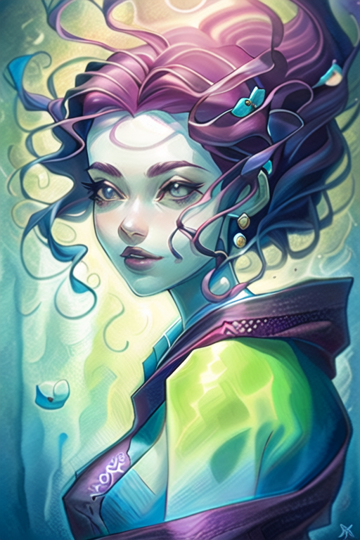
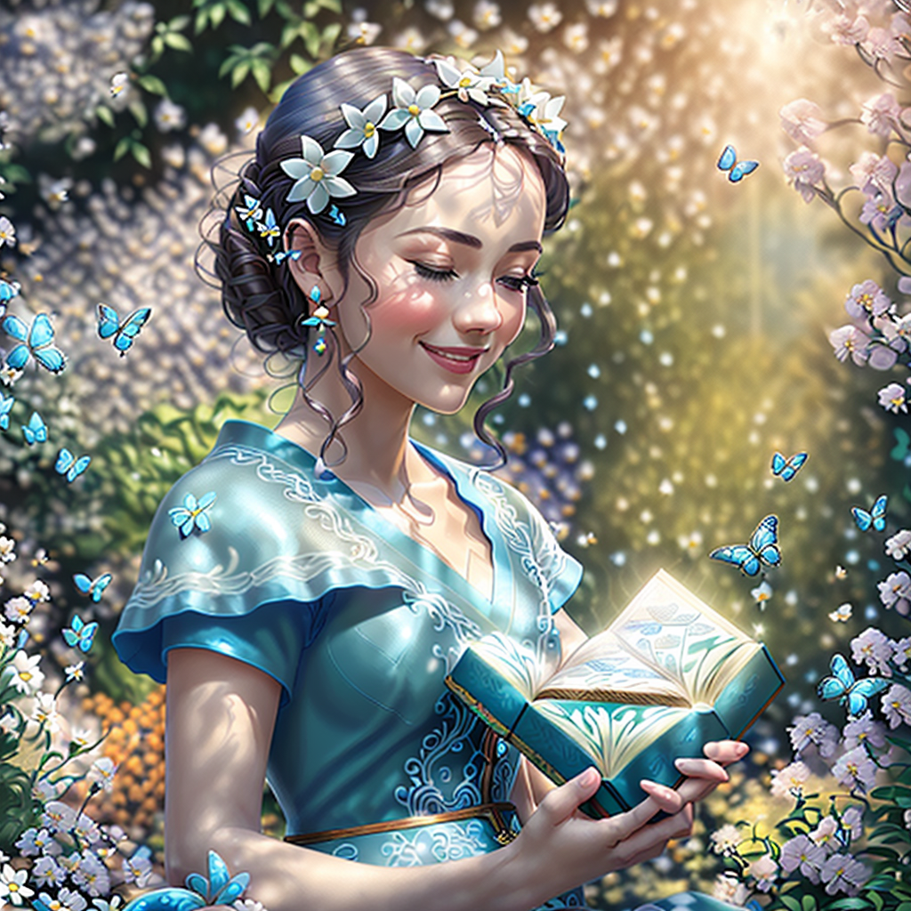
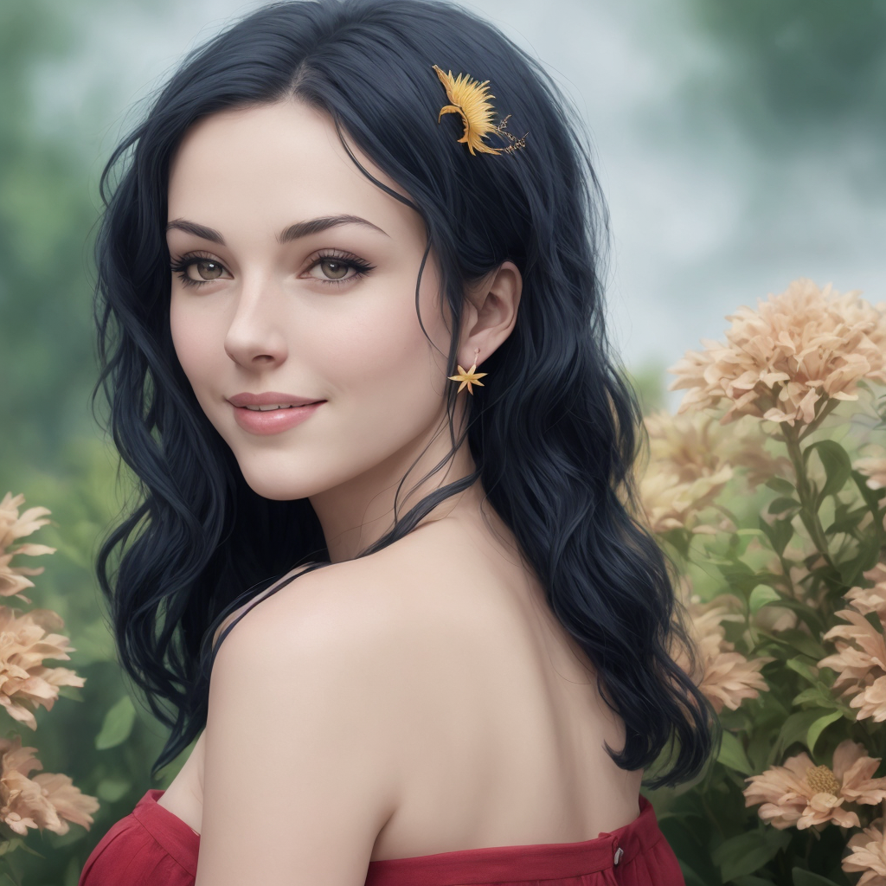

# Style-Finetune-StableDiffusion

Finetune style for stable diffusion via LORA

* Model: < 1M File size
* Training Data: 6 Images
* Training Time: ~10 min in RTX 3090

## Training Data

[Here](./TrainingData)

### Sample

### Ouput Images

[Here](.\OutputImages)

Notices that the face's shape, the hair style is similar to training data, while custom environments and poses are possible.

### Sample

